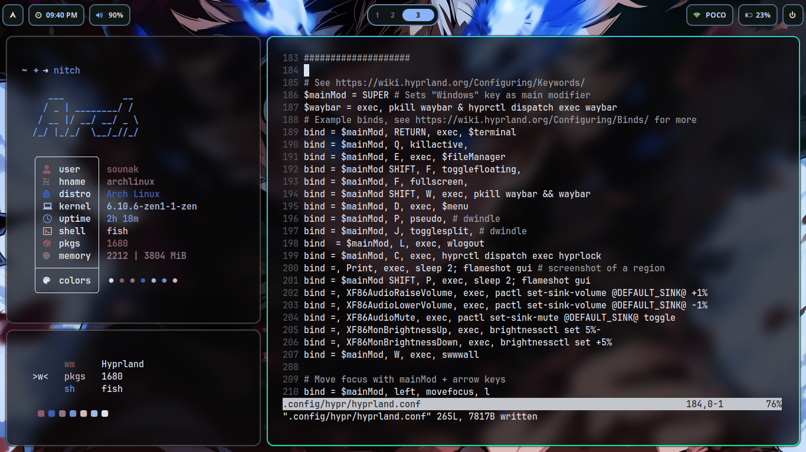

# Hyprland-Rice
My linux Hyprland dot files.

- Clone the repo and cd into it.
- Run:
	```mv .config/* ~/.config/```
- Move wallpaper from the repo to your desired directory and change the path to it in the Hyprpaper config file at that section.
- Enjoy!
- 
## Screenshots:




## Wallpapers:


